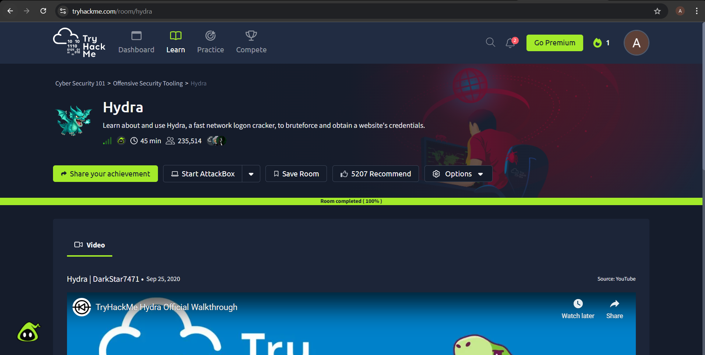
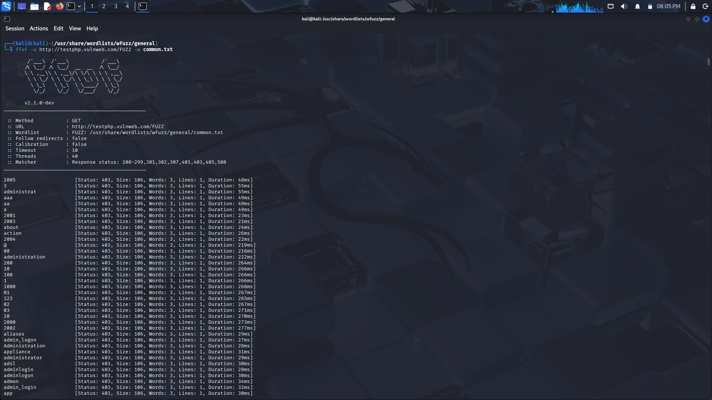

# 📅 Week 1 – Know Yourself

## 🎯 Objective
Understand my hacker mindset, complete initial tasks, and start practical learning.

---

## 🧬 My Hacker Archetype
The Scholar

Why I think this fits me:
- I need to understand before i touch anything.
- Takes time to implement things so that unexpected things may not happen.

---

## 🎮 Game Experience
- My approach to answering questions: It was very fast and I was in a hurry.
- Something that surprised me: That I am the Scholar rather than Breaker (Just 1 point difference).

---

## 💻 TryHackMe / Hack The Box
- Platform: TryHackMe
- Room Name: Hydra

### 🧠 What I Learned
- Hydra is a password brute-forcing tool used to crack login credentials.
- It supports multiple protocols like SSH, FTP, HTTP, etc.

### 📸 Proof


---

## 🛠 Tool Deep Dive
Tool Name: ffuf (Fuzz Faster U Fool)

### 🔍 What it does
- ffuf is a web fuzzing tool used to discover hidden endpoints, parameters, and inputs in a web application. It helps identify parts of a system that are not directly visible by systematically testing different inputs.

### ⚙️ How it works
- ffuf works by replacing a placeholder keyword (commonly `FUZZ`) in a request with values from a wordlist. For each value, it sends an HTTP request to the target and analyzes the response.

It evaluates responses based on:
- Status codes (200, 403, 404)
- Response size
- Response content

This allows it to identify valid or interesting results from a large number of requests.

### 💻 Commands Used

#### 1. Basic Directory Fuzzing
```bash
ffuf -u http://target/FUZZ -w /path/to/wordlist.txt
```
#### 2. Parameter Fuzzing
```bash
ffuf -u "http://target/page?param=FUZZ" -w /path/to/wordlist.txt
```

#### 3. Filtering Responses
```bash
ffuf -u http://target/FUZZ -w wordlist.txt -fs 4242
```

### 🧪 My Experiment
I ran:
```bash
ffuf -u http://testphp.vulnweb.com/FUZZ -w common.txt
```
Output:-


### 🌍 Real-world usage
- Discover hidden directories and files (e.g., /admin, /backup)
- Identify valid parameters and inputs
- Test how applications handle unexpected or unknown inputs

### 💡 My Insight
- I realized that ffuf is not just about brute-forcing directories, but about systematically testing inputs and analyzing differences in server responses to identify hidden functionality.
---

## 🤖 AI Learning
### ❓ Question I asked:
- Why do banks still use 4-digit PINs when they are considered weak?

### 💡 What I understood:
- I learned that a 4-digit PIN is not meant to be secure on its own, but as part of a larger security system. Banks rely on multiple layers such as limited login attempts (rate limiting), physical possession of the card, and secure hardware like EMV chips and HSMs that prevent offline brute-force attacks.
- Even though the total number of PIN combinations is small, attackers usually get only a few attempts (typically 3), making brute-force practically impossible.
- Additionally, banks use monitoring systems to detect suspicious activity, so even a correct PIN does not guarantee success.
- I also understood that increasing PIN complexity could reduce usability, leading users to adopt insecure behaviors like writing it down. So, banks balance security and usability by keeping the PIN simple while strengthening the surrounding system.

---

## ⚠️ Challenges Faced
- At the beginning, I did not fully understand how ffuf actually identifies valid results. I was only running commands without understanding what response size filtering or status code filtering really meant.
- While working on the Hydra room, I understood the concept of brute forcing, but I still felt like I was just following steps instead of thinking like an attacker.
- I also realized that many tools look simple on the surface, but understanding what they actually do in real-world scenarios is much harder than expected.

---

## 💡 How I Solved Them
- Instead of just running commands, I tried to understand what happens after every request is sent (status code, response length, filtering logic). This helped me understand how fuzzing actually works instead of blindly using the tool.
- I slowed down while learning instead of rushing to complete the room quickly.

---

## 🔍 Key Takeaways

- Tools are easy to run but hard to understand deeply. Real learning starts only after understanding what the tool is doing internally.
- Fuzzing is not just brute forcing directories — it is about analyzing how a system reacts to different inputs.
- I realized that my learning style is more about understanding first and then implementing, which matches the “Scholar” mindset.
- Instead of trying to learn many tools quickly, it is better to go deep into one tool and understand it completely.
- Real cybersecurity learning requires patience, not speed.
---
